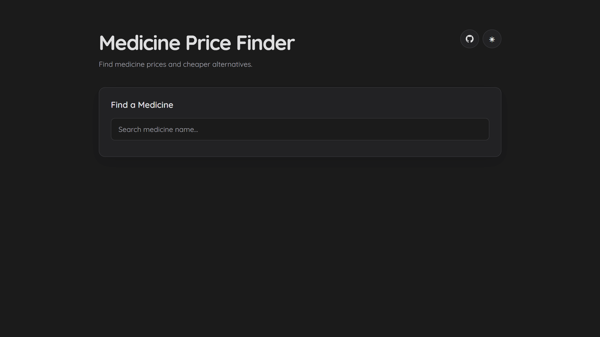

<div align="center">

# Medicine Price Finder

Predict medicine prices and discover cheaper alternatives using machine learning.

[](https://www.python.org/)
[](https://fastapi.tiangolo.com/)
[](https://scikit-learn.org/)
[](https://git-lfs.com/)

**[Live Demo](YOUR_DEPLOYED_URL)** · **[Source Code](https://github.com/Oblivionium/medicine-finder)**

</div>

## Overview

Medicine Price Finder is a machine learning web application that predicts the price of a medicine and helps users find cheaper alternatives.

Instead of entering model features manually, users can search for a medicine, select the exact product, and get a predicted price. The application can then find cheaper medicines with the same composition.

The project combines a **Random Forest regression model**, a **FastAPI backend**, and a lightweight **HTML/CSS/JavaScript frontend**.

**Update**: There has been a temporary snag with the live demo deployment due to vender memory limits. I am still weighing the quality-availability tradeoff and will be making changes to fix this as soon as possible. 

## Preview



## Features

* Medicine search with exact, prefix, substring, and fuzzy matching
* Search results for different strengths and dosage forms
* Machine-learning based price prediction
* Cheaper alternative finder based on medicine composition
* Dark mode by default
* Light mode with persistent theme preference
* Responsive frontend
* REST API powered by FastAPI
* Interactive API documentation through Swagger
* Model versioned using Git LFS

## How It Works

```text
                     Medicine name
                           |
                           v
                  +-----------------+
                  | Medicine Search |
                  +--------+--------+
                           |
                           v
                  Select exact product
                           |
              +------------+------------+
              |                         |
              v                         v
       Price Prediction         Composition Search
              |                         |
              v                         v
       Predicted Price         Cheaper Alternatives
```

### Medicine Search

The search system prioritizes increasingly broad matches:

1. Exact matches
2. Prefix matches
3. Substring matches
4. Fuzzy matching as a fallback

This prevents unrelated medicines from dominating the results simply because their names happen to be similar.

For example:

```text
Tagrisso
    |
    +-- Tagrisso 40mg Tablet
    |
    +-- Tagrisso 80mg Tablet
```

### Price Prediction

After selecting a medicine, its information is retrieved from the dataset and passed to the trained model.

The model uses:

* Dosage form
* Pack size
* Pack unit
* Primary ingredient
* Primary strength
* Therapeutic class
* Number of active ingredients

The user does not need to enter these features manually.

### Alternative Finder

The alternative finder uses the medicine's composition to identify other products with the same active ingredients.

It:

* Finds medicines with matching composition
* Removes the selected medicine
* Keeps cheaper products
* Sorts alternatives by price
* Returns the most relevant results

## Model

The final model is a `RandomForestRegressor`.

```python
RandomForestRegressor(
    n_estimators=100,
    random_state=42,
    n_jobs=-1
)
```

### Evaluation

Evaluation was performed on a held-out test set.

| Metric |   Score |
| ------ | ------: |
| MAE    | ₹116.32 |
| R²     |  0.3599 |
| MdAPE  |  17.04% |

The dataset has a strongly right-skewed price distribution, with a relatively small number of very expensive medicines.

Because of this, MAE is considered alongside R² and MdAPE rather than being treated as the only measure of model performance.

The model performs substantially better on the lower-priced majority of medicines than on the long tail of expensive products.

## Price Distribution

The price distribution is strongly right-skewed.

| Price Range   | Medicine Count |        MAE |
| ------------- | -------------: | ---------: |
| ₹0–100        |         31,747 |     ₹16.88 |
| ₹100–500      |         16,995 |     ₹45.62 |
| ₹500–2,000    |          1,323 |    ₹473.34 |
| ₹2,000–10,000 |            560 |  ₹1,796.27 |
| ₹10,000+      |            169 | ₹17,545.05 |

This imbalance is one of the main limitations of the current model.

## Tech Stack

### Machine Learning

* Python
* pandas
* NumPy
* scikit-learn
* joblib

### Backend

* FastAPI
* Uvicorn
* RapidFuzz

### Frontend

* HTML
* CSS
* JavaScript

### Tooling

* Git
* Git LFS
* Jupyter
* GitHub

## Project Structure

```text
medicine-finder/
|
+-- backend/
|   +-- main.py
|
+-- data/
|   +-- medicine_data.csv
|
+-- docs/
|   +-- home.png
|
+-- frontend/
|   +-- index.html
|   +-- script.js
|   +-- style.css
|
+-- models/
|   +-- medicine_price_model.joblib
|
+-- notebooks/
|   +-- eda.ipynb
|   +-- eda.py
|
+-- src/
|   +-- alternatives.py
|   +-- cleaning.py
|   +-- data.py
|   +-- features.py
|   +-- predict.py
|   +-- search.py
|
+-- .gitattributes
+-- .gitignore
+-- .python-version
+-- README.md
+-- requirements.txt
```

## Running Locally

### 1. Clone the repository

```bash
git clone https://github.com/Oblivionium/medicine-finder.git
cd medicine-finder
```

### 2. Set up Git LFS

The trained model is stored using Git LFS.

```bash
git lfs install
git lfs pull
```

### 3. Create a virtual environment

```bash
python -m venv .venv
```

Activate it on Linux or WSL:

```bash
source .venv/bin/activate
```

On Windows PowerShell:

```powershell
.venv\Scripts\Activate.ps1
```

### 4. Install dependencies

```bash
pip install -r requirements.txt
```

### 5. Start the application

Run the following command from the project root:

```bash
uvicorn backend.main:app --reload
```

The application will be available at:

```text
http://127.0.0.1:8000
```

FastAPI's interactive API documentation is available at:

```text
http://127.0.0.1:8000/docs
```

The health endpoint is available at:

```text
http://127.0.0.1:8000/health
```

## API

### Health Check

```http
GET /health
```

Example response:

```json
{
    "status": "ok"
}
```

### Medicine Search

```http
GET /api/search?query=Tagrisso
```

Searches the dataset for matching medicines.

### Price Prediction

```http
GET /api/predict/{medicine_name}
```

Retrieves the selected medicine and returns its predicted price.

### Alternatives

```http
GET /api/alternatives/{medicine_name}
```

Returns cheaper medicines with matching composition.

## Development

Model development and exploratory data analysis were initially performed in `notebooks/eda.ipynb`.

After the modelling workflow was finalized, the application-specific code was separated into the `src/` modules so that the deployed application does not depend on the notebook.

The frontend is served directly by FastAPI, keeping the application as a single deployable service.

## Limitations

The predicted price should be treated as an estimate rather than an actual market price.

The model does not account for:

* Pharmacy-specific pricing
* Location
* Discounts
* Availability
* Real-time market changes
* Brand preferences
* Taxes or other purchase-specific factors

The dataset is also strongly skewed toward lower-priced medicines, which limits prediction accuracy for the relatively small number of high-priced products.

## Deployment

The application is designed to run as a single web service.

```text
Browser
   |
   v
FastAPI
   |
   +-- Frontend
   |
   +-- Medicine Search
   |
   +-- Price Prediction
   |
   +-- Alternative Finder
          |
          +-- Medicine Dataset
          |
          +-- Random Forest Model
```

## License

This project was developed for educational and demonstration purposes.

---

[GitHub Repository](https://github.com/Oblivionium/medicine-finder)
